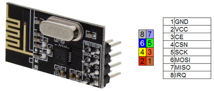
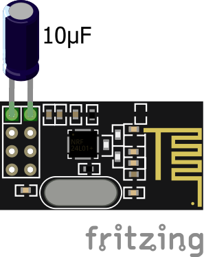

# About Wireless Joystick with nRF24L01

### Install RF24 library
Open the Arduino IDE and select Sketch from the top menu bar and select Include Library from the Sketch menu drop-down.

Select Add .ZIP Library from the Include Library sub-menu and use the dialog box to select the ZIP file you have downloaded.

Finally, the **RF24 library** will be installed.

___
### nRF24L01 Pinout

___
### Powering the nRF24L01 module by connecting it to the 3.3V pin
In these cases it is advisable to use a special adapter or to solder a 10μF electrolytic capacitor to the module, placing it between the Vcc and GND pin.



### An example of interfacing uC and nRF24L01
| nRF24L01	| Arduino UNO |
| --------- | ----------- |
|Vcc (V+)	| 3.3V |
|GND	| GND |
|CSN	| 8 |
|CE	| 7 |
|SCK	| 13 |
|MOSI	| 11 |
|MISO	 |12 |

Pls, note: the IRQ pin, used as a “switch” to turn the module on/off, will not be covered in this guide.

### Sketch
```c++
// Common code both in RX and TX
#include <SPI.h>
#include <nRF24L01.h>
#include <RF24.h>
 
RF24 myRF24 (7, 8); // according to the above table
byte address[6] = "00001";
```
Pls, note: the setting of the methods *.setChannel* and *.setDataRate* will not be covered in this guide.
```c++
// Setup of RX
Serial.begin(9600);
 
myRF24.begin();
myRF24.openWritingPipe(address);
myRF24.setPALevel(RF24_PA_MIN); // even RF24_PA_MAX, obviously
myRF24.stopListening();
```

```c++
// Setup of TX
myRF24.begin();
myRF24.openReadingPipe(0, address);
myRF24.setPALevel(RF24_PA_MIN); // even RF24_PA_MAX, obviously
myRF24.startListening();
```

```c++
...more
```
___
### Demo Sketches
[TX demo Sketch](https://github.com/ROBOTICronics/Wireless/blob/main/nRF24L01/RF24-TXdemo.ino)

[RX demo Sketch](https://github.com/ROBOTICronics/Wireless/blob/main/nRF24L01/RF24-RXdemo.ino)
